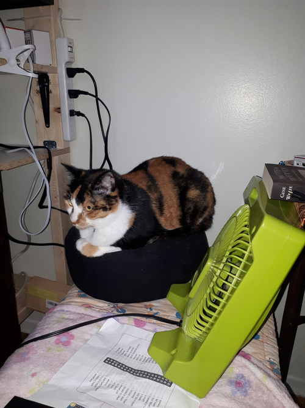
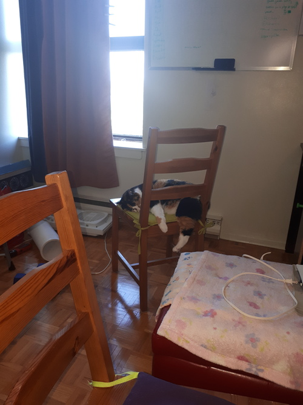
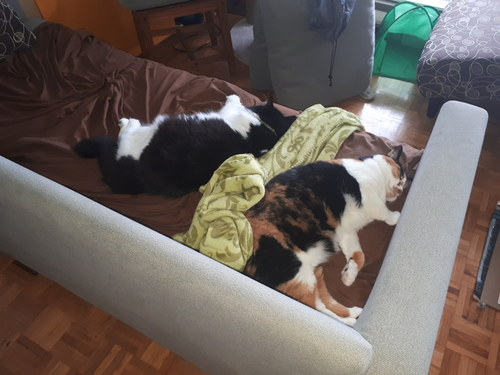
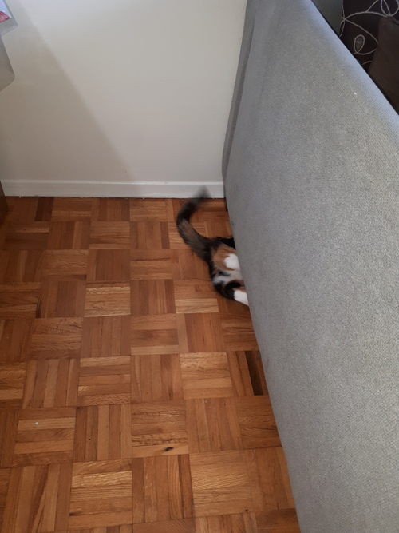
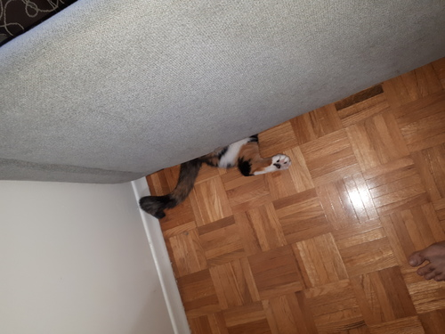

## Cats in various states of rest

The cats love sleeping on my meditation cushion. The cushion happens to be the right size for them, so they can bundle up on it and relax.

This morning my cat came to see me and decided to sleep on the chair. The cat overflows the edge because it's sleeping on its side.

I found the two cats sleeping close to each other. This happens rarely. It may be that the green blanket has put a barrier between them and has prevented feline strife.

Here are two photos of the cat sneaking underneath the couch.

