## 2021 Cat Calendar

Here is the 2021 cat calendar (or "catlendar").

I've resized the images below. You can open them in a new tab to get more resolution. They're in US letter proportions, so you could print them to make a very basic calendar.

For 2022 I'm probably going to improve the <https://github.com/sjchiass/catlendar> code so that you can print your own physical calendars. In order to print good calendars, the photos and calendars have to be correctly arranged so that you can fold everything.

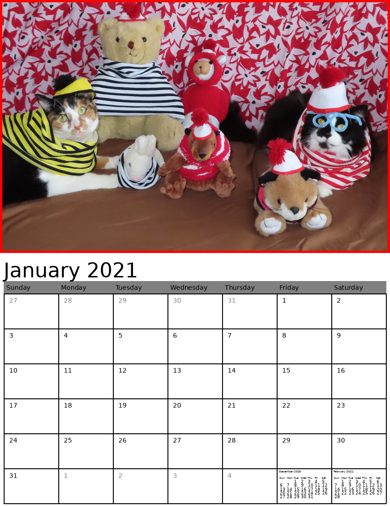

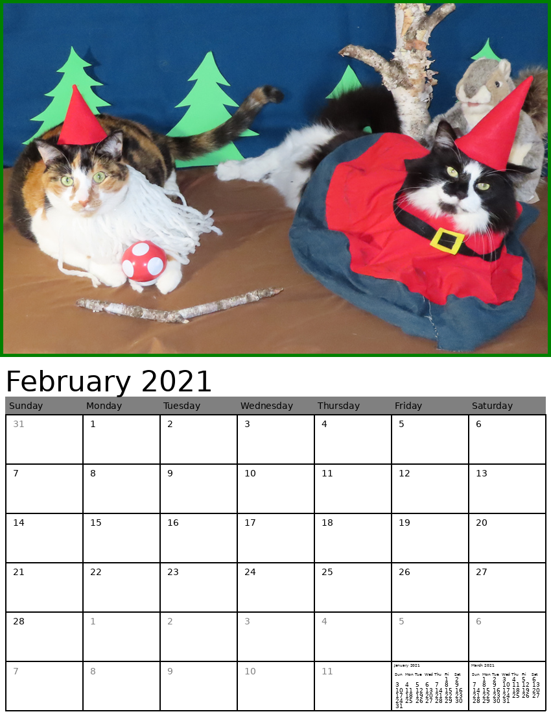

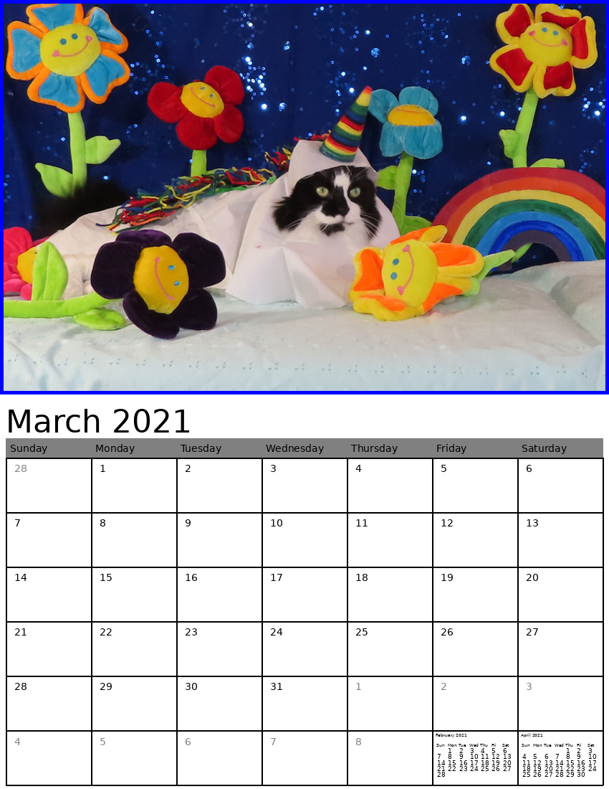

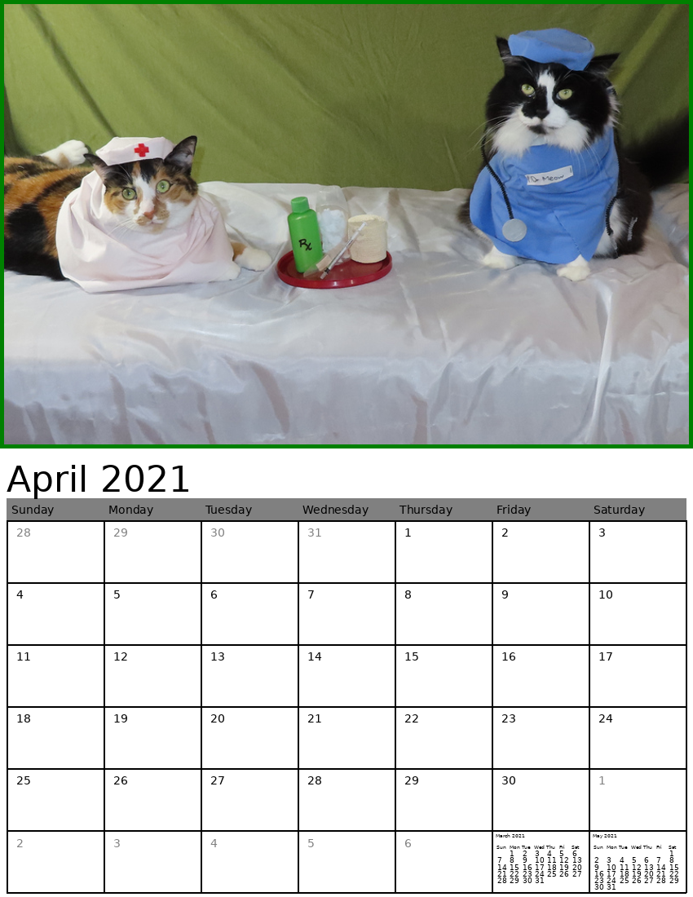

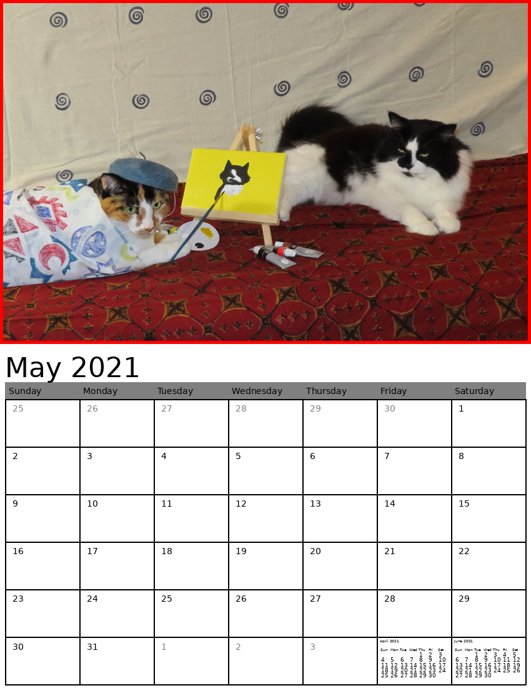

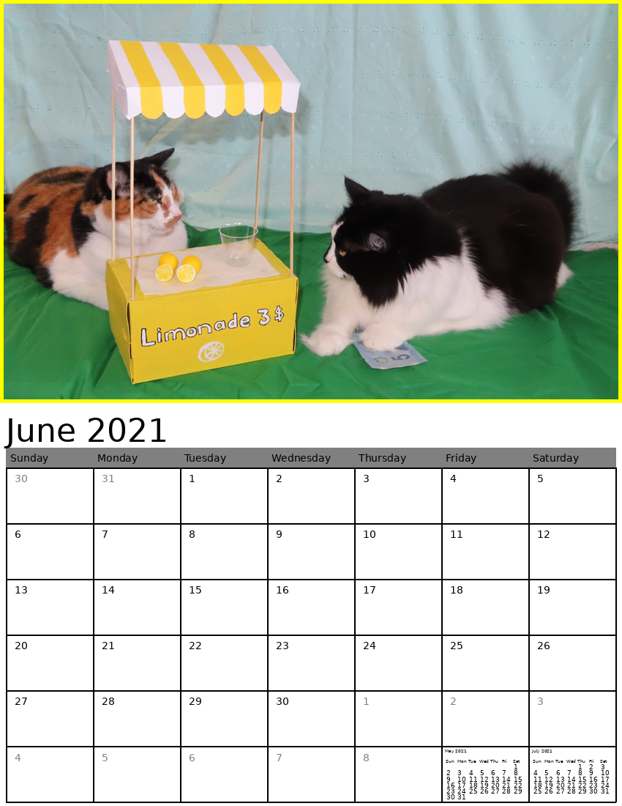

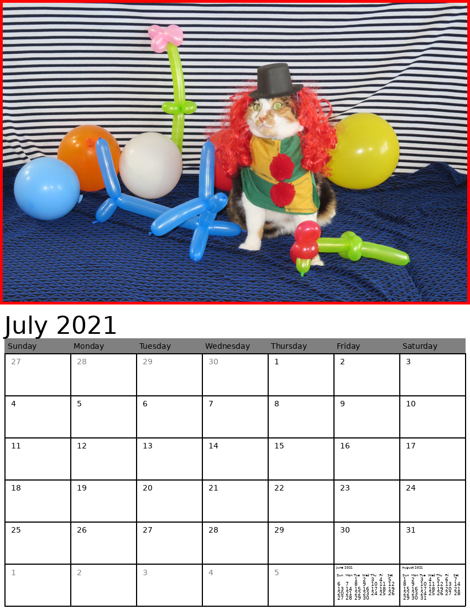

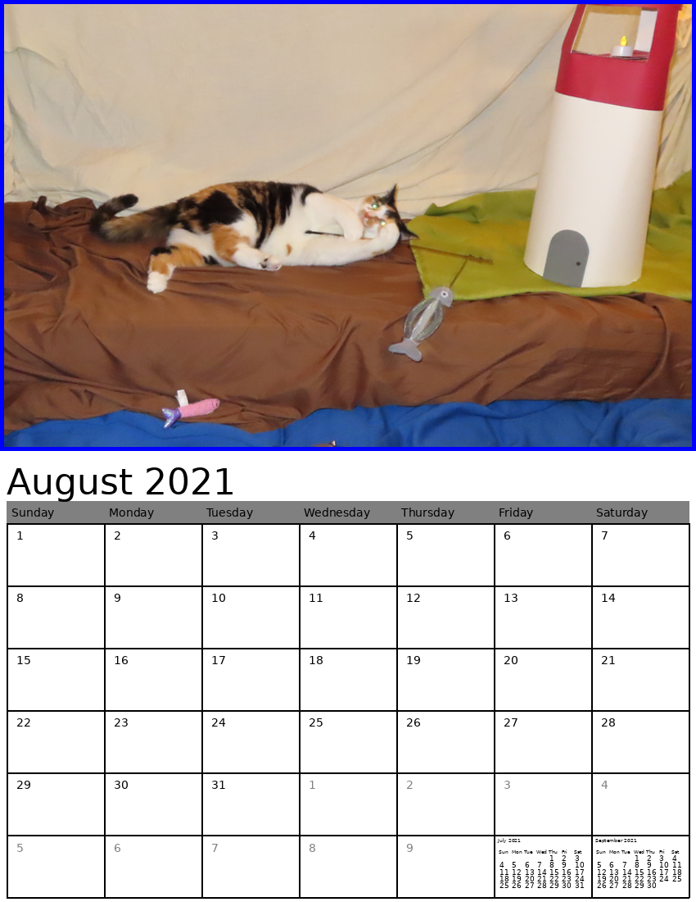

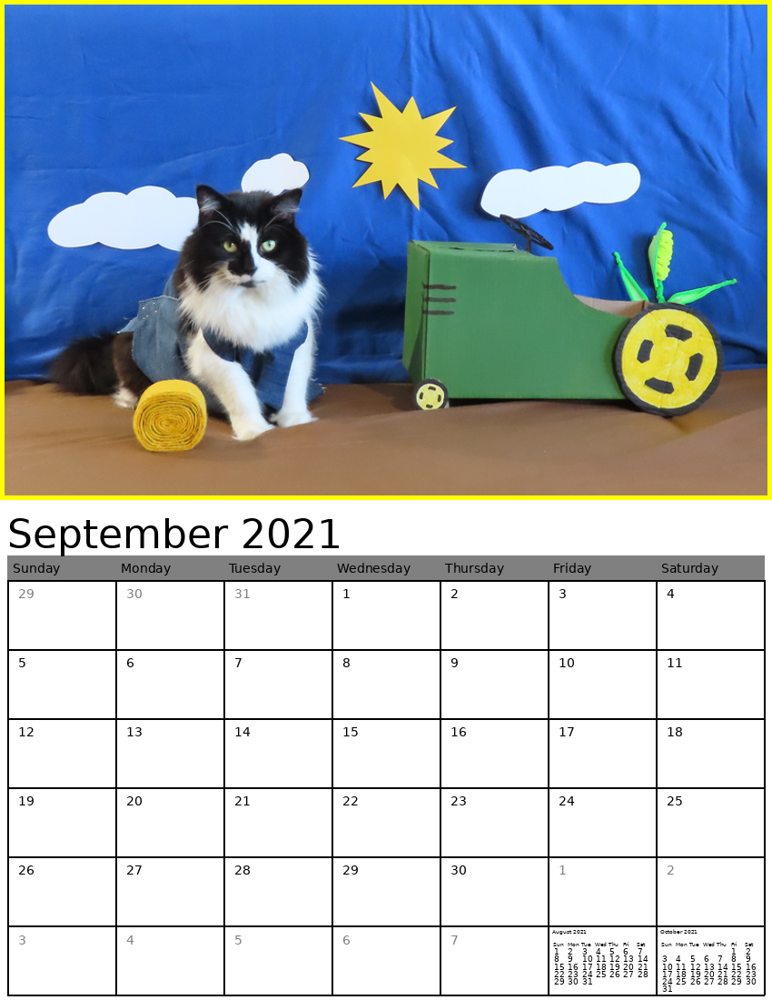

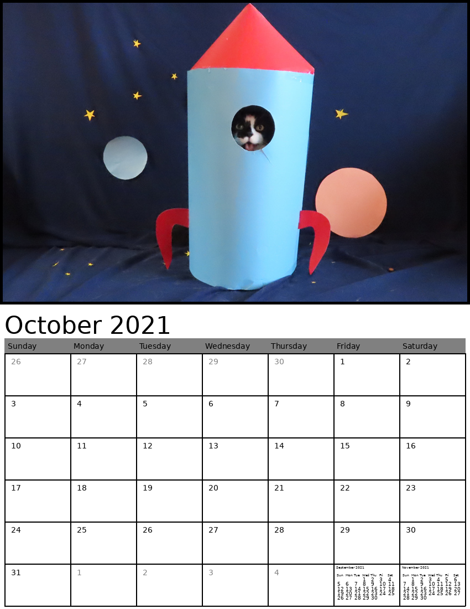

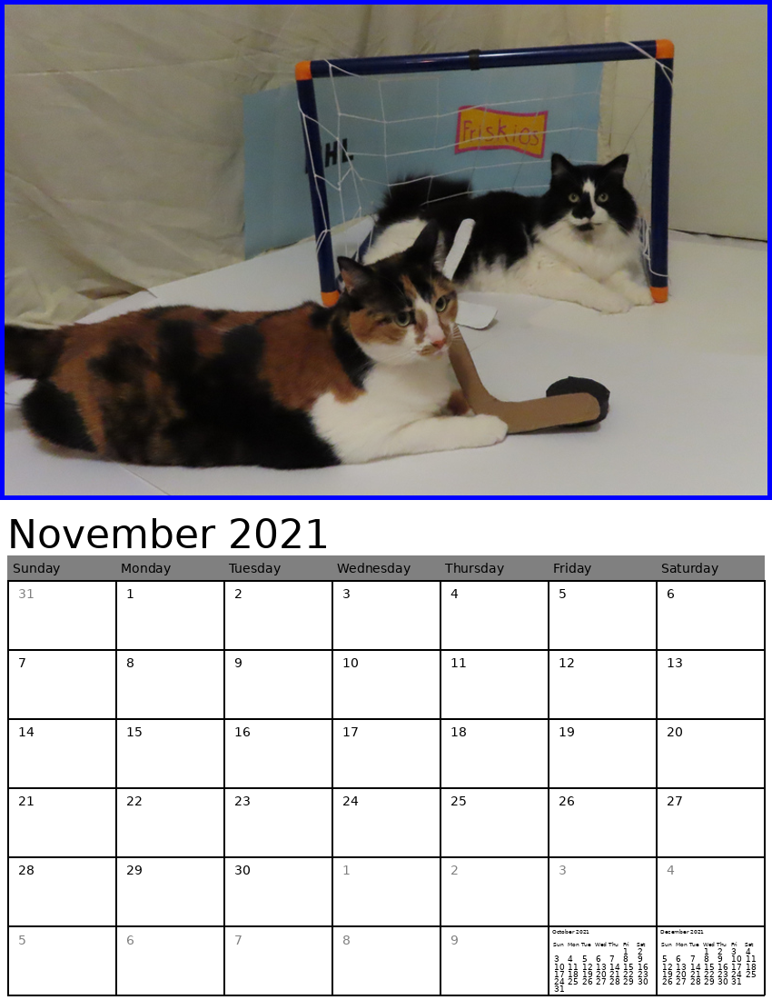

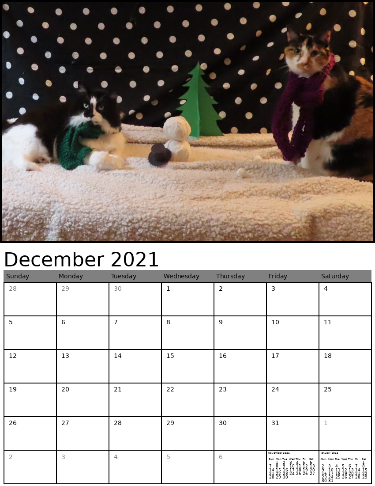
