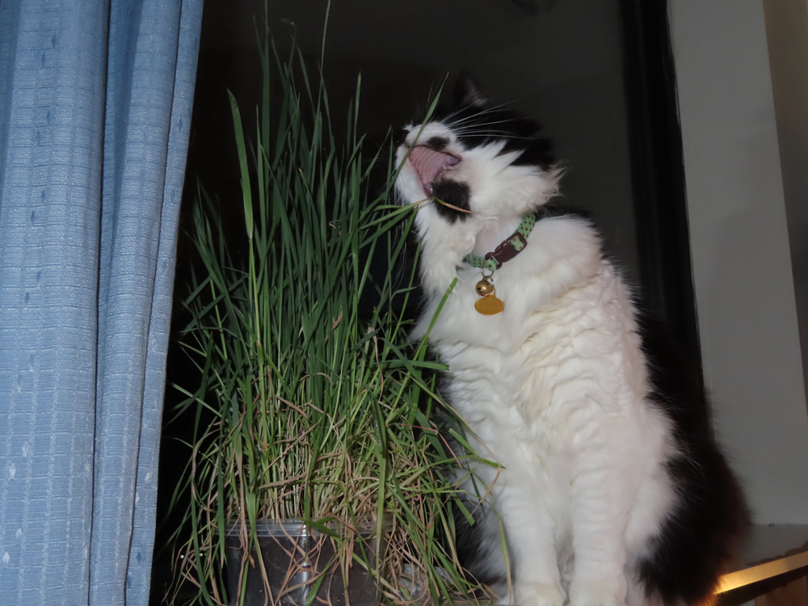
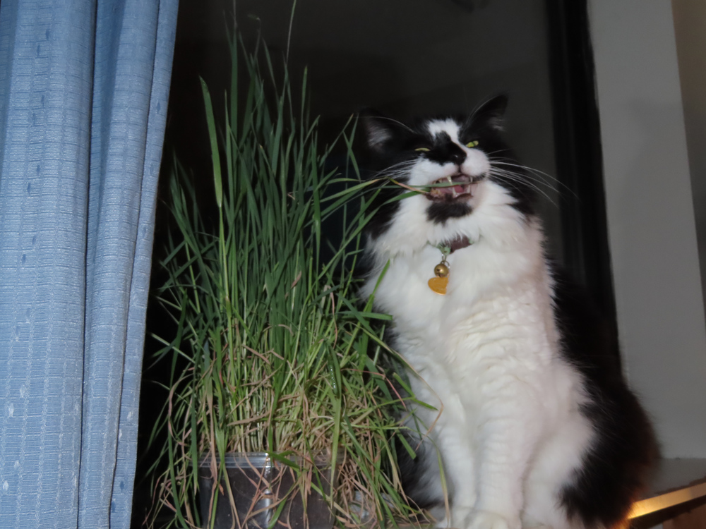
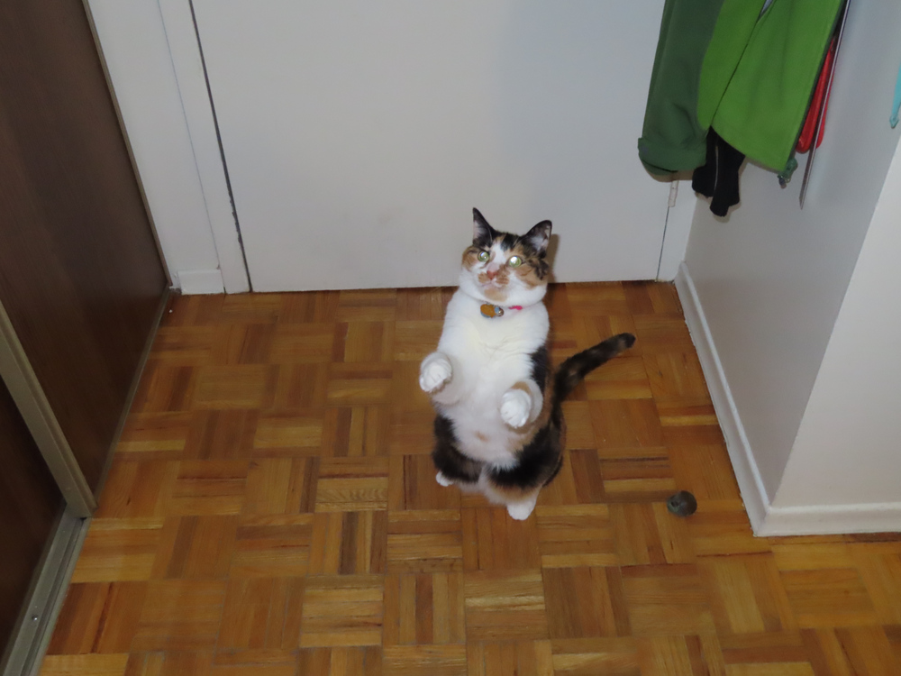
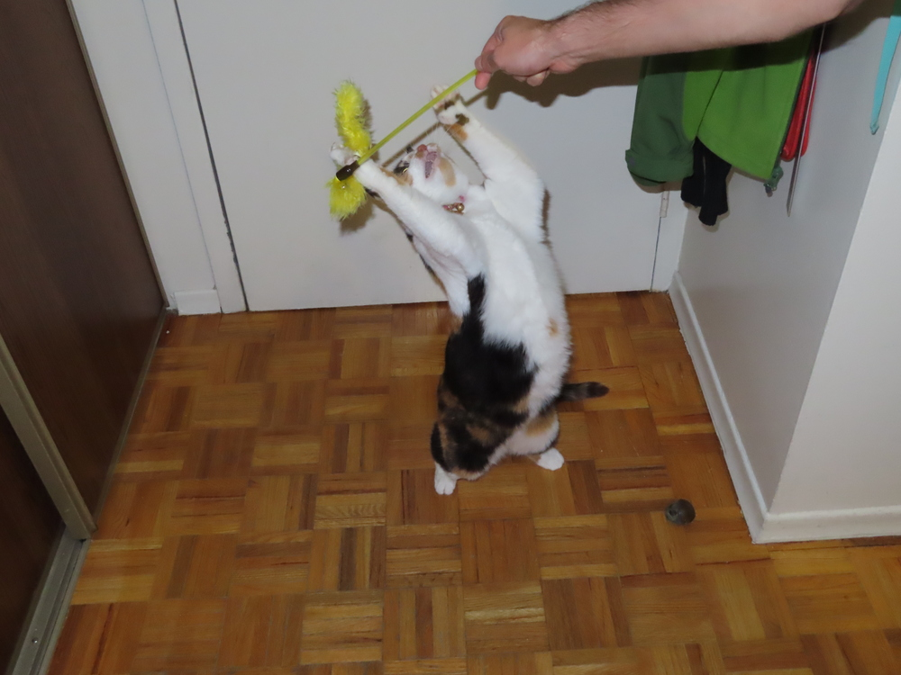
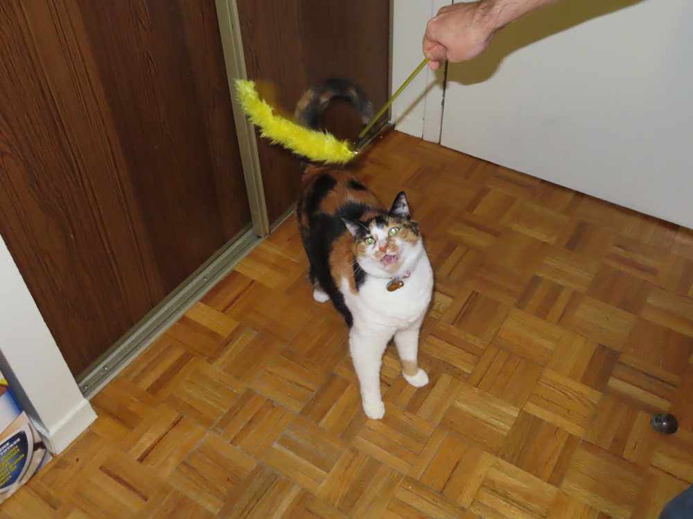
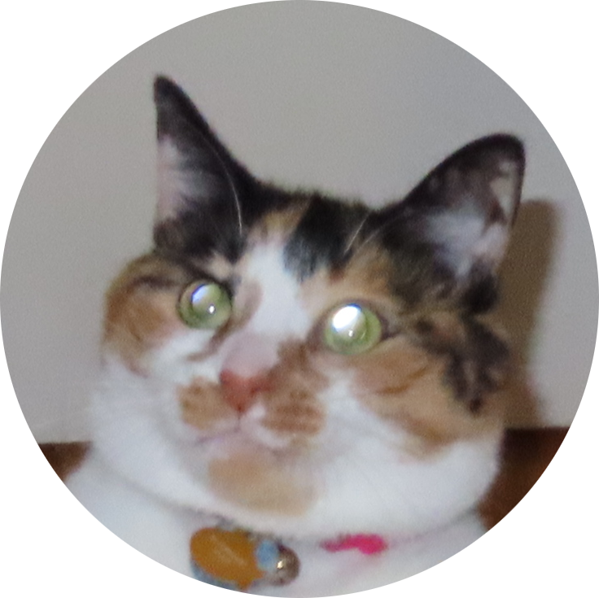
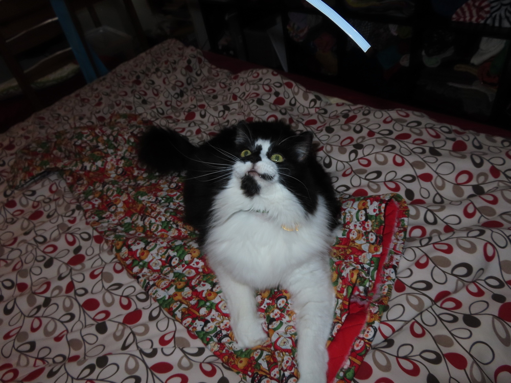
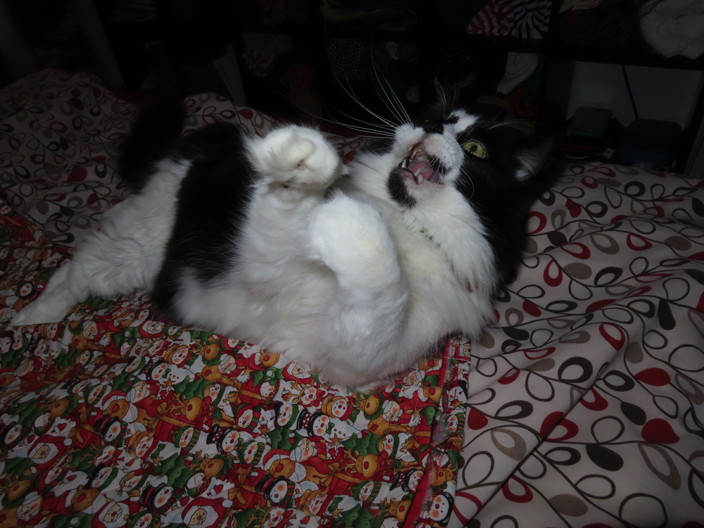

(Looks like Hugo supports emojis: <https://gohugo.io/functions/emojify/> I use them below.)

### Eating cat grass

The cat is bad at getting the grass in its mouth, so it opens it as big as possible and lunges at it.

When they have grass in their mouths they masticate very noisily. :drooling_face:

### Playing with the yellow floof

This cat has a habit of scrunching its face together sometimes.

This cat is also very long. It sometimes contorts itself backwards to catch toys.

When it's really into the game, it just forgets to close its mouth.

Could this be my new icon? :smiling_face_with_hearts:

### Angry at a piece of plastic

Not sure why but only sometimes are the cats' canines visible like this. Makes them seem evil. :vampire:

:dragon_face: :heart: