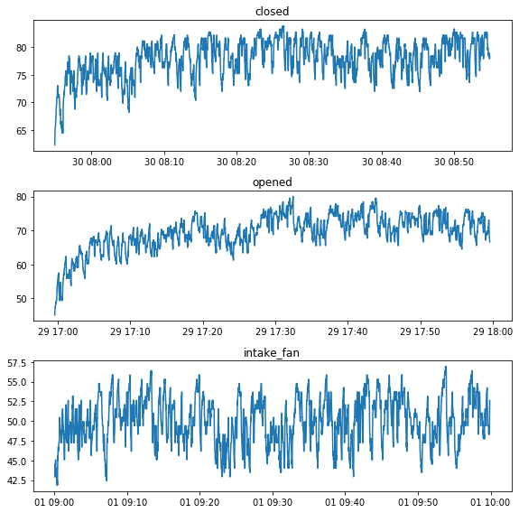
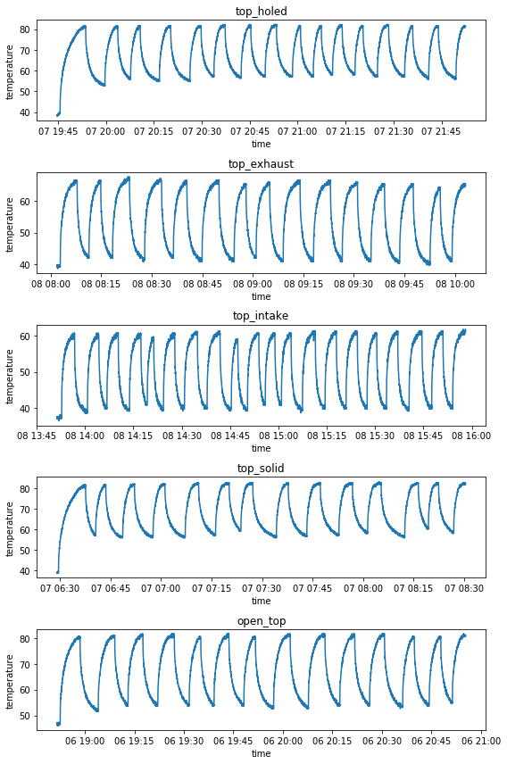
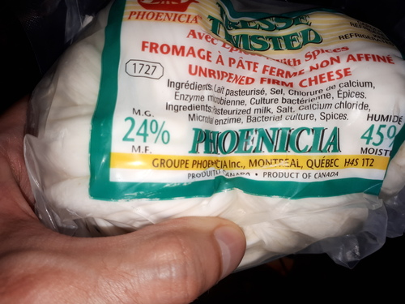
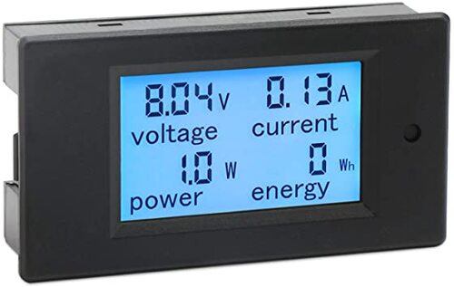
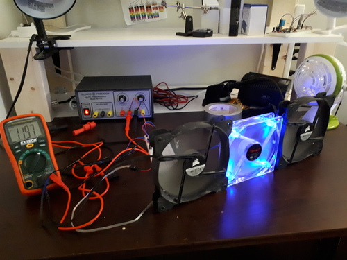

### Past work

GitHub: <https://github.com/sjchiass/pitemp>

I had been thinking a lot about the best way to get good temperature data for my raspberry pi temperature project, and it all worked out alright.

My old way of collecting data had an issue with heat building up in the case and having biased datasets for closed cases. The data was good for simulating day-to-day use, but in day-to-day use of a raspberry pi, those little plastic cases are little ovens. Here is the problematic data.

(Useful: `plt.tight_layout()` got the titles to stop writing over the other plots' axes.)

As you can see above, the case heats up and stays hot for the duration of the test. The data isn't that great to figuring out how much heat the case dissipates. (I should come up with a measure of this bias, actually.)

The new script lets the case heat up to a maximum and then lets it cool down to a minimum. It waits 30 seconds before "declaring" the minimums and maximums. It does this for two hours. Here is the data. As you can see, much fairer to the closed cases.

I was also proud of this little graph showing the minimums and maximums. Nice colors and some reference lines.

### This week

I'm going to keep cleaning up the analysis I've bundled with the code and data.

I may try the new data collection method with more case configurations, like removing the side panels. I'm also able to collect data on the heatsinks, but I haven't done that yet. Should be interesting: heatsinks probably benefit the most from fans and it'd be interesting to measure the interaction there.

## Other things

I found this interesting cheese at the store. I think it may be like the strange bottled cheese I found in Quebec truck stops. If my guess is correct, this will be very tough and salty cheese. It's not that pleasant to eat, but its saltiness satisfies junk food cravings.

Interestingly, the brand is Phoenicia, which implies this may be a kind of cheese popular in the Middle East. I found it next to the halloumi cheese.

I think I'm going to buy this $20 "DROK" volt, amp, watt and watt-hour display from Amazon and connect it to my Elenco bench power supply. It'll help me see the current draw of what I'm powering from there. I'll have to test and see if it measures properly.

Now I'll be able to measure voltage and current when playing with case fans! With only one multimeter, I can only measure or voltage at once. (And I have to move things around a bit.)

