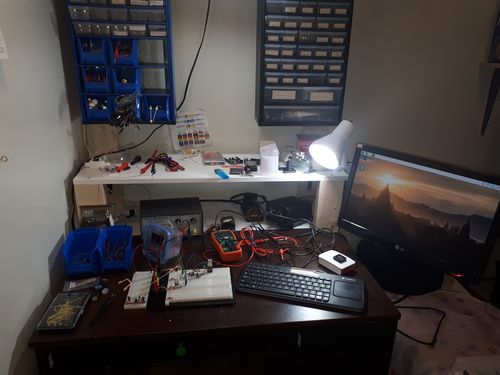
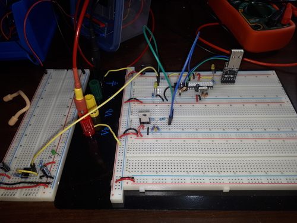
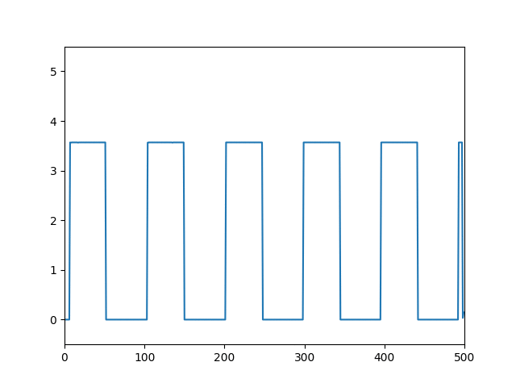
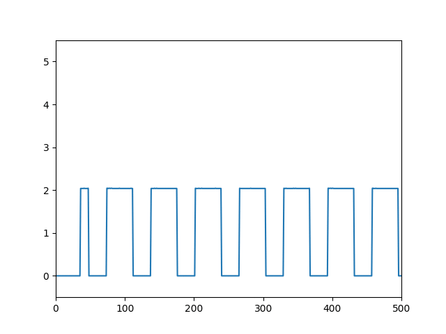
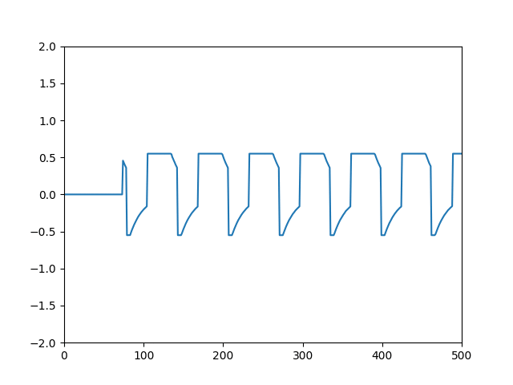
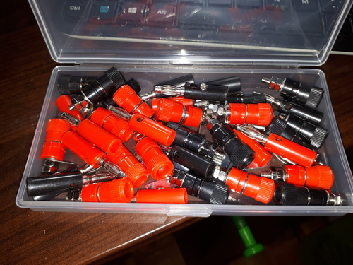
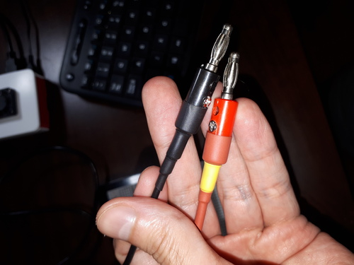
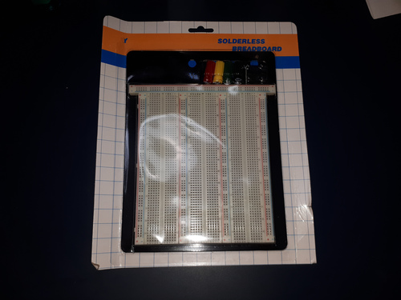
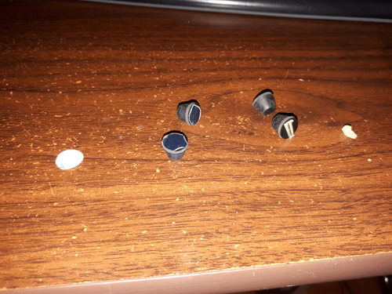

### Past week

#### The updated workspace

Last week I set up a workspace to program an Arduino on a breadboard. I've attached the monitor to an arm to give more space. Originally, the monitor was higher up, but I found that I didn't like having to crane my head upwards.



#### The Arduino oscilloscope

At this point I have more of a voltage logger than a functional oscilloscope. Yet even this is valuable because I can see changes in voltage a lot better than with a multimeter.

The circuit is the same as in the matchbox oscilloscope guide: <https://www.instructables.com/id/Oscilloscope-in-a-Matchbox-Arduino/>



The 100nF caramic capacitors turned out to be important. Using nicer-looking mylar capacitors (in beautiful green) gave worse signals. Ceramics are better than mylar (polyester) for these things. (I wish I could find a use for these beautiful green capacitors.)

The test signal comes from a 555 timer, so it's a square wave.

At first the signals weren't read properly. It turned out that I wasn't properly reading the serial data in Python. If I missed a byte, the values would drop by a lot (ex: 1010 --> 010).



I cleaned up my Python code by decoding the serial data, splitting it by newlines, and only keeping numbers that are complete 4-character records.

```
# Read the Arduino's Serial.println()
# The Arduino pads the integers with leading 0s so that they're always
# 4 characters wide
x1 = ard.read(ard.inWaiting()).decode("ascii")
x1 = [(5.0 * int(x) / 1023.0) for x in x1.split("\r\n") if len(x) == 4]
```
The results are now clean.



The circuit can also read from a capacitor-bypassed signal. The 0-5V measure above is instead pushed through a 200nF capacitor and adjusted to a range of 0V to 1.1V. This bypassed signal is interpreted at -0.55V and +0.55V.

You can see the effect of the capacitor on the signal. The square wave has rounded edges. I think this measurement mode would be better with faster and finer signals, such as fast-acting digital ICs.



#### Fun with banana plugs

I got some "cheap" banana plugs on Amazon for $16. The reviews for these were bad, but I really wanted banana plugs; ANY BANANA PLUGS!

They came in a nice box, with free screwdriver and wrench. Oh, there are also binding posts in there, but I'm not sure if I'll use them.



The reviews warned that it was difficult to solder the plugs, but I found that an iron at 450C with lead-free solder did the trick. I used primary wire for the wires, which is 18-gauge stranded copper. I reinforced the plugs with three layers of heat-shrink tubing (very nice!).



#### A new breadboard

I bought this "de luxe" breadboard: <https://www.buyapi.ca/product/large-solderless-breadboard/>

For some reason I thought the binding posts were connected to the breadboard (like through some internal circuit). Instead you need to wire the binding posts to the breadboard power rails.



Also, the rubber feet had useless glue, which is what some reviews complained about. The solution: use superglue (cyanoacrylate). The superglue glued the rubber feet perfectly.



### Next week

I'm going to keep playing with my homemade voltage logger. There are a few things to do.

  1. Add some kind of interface to navigate the data.
  2. Look at how real oscilloscopes are used.
  3. Create better test data, such as faster-acting circuit.

I shouldn't forget to wrap up my `pitemp` project: <https://github.com/sjchiass/pitemp>
