Last summer I had the pleasure of trying lots of smoked BBQ pulled pork, so this year I decided to try cooking it myself. The results were quite good even if I only smoked the meat for 2 hours. The rub, the sauce, and a bit of smoke flavour made for great little sandwiches. If I were to try the recipe again, I would smoke the meat longer to get more of that rich applewood flavor.

The pulled pork was great in a slice of bread. It was tender, tangy, and flavourful.

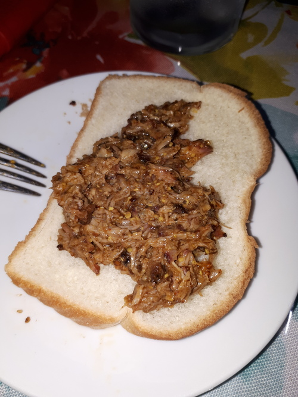

## Lessons

* Too much rub ends up burning
* If you inject liquid into the meat, too much pressure will shoot the liquid back at you
* A longer smoke would give more flavour
* Make sure to identify your smoking wood beforehand (label it mesquite, applewood, hickory, etc.)
* Better coal management could mean less ash

## Ingredients

We got a 1kg pork shoulder boneless blade roast from the grocery store. It was a medium-sized block of fatty meat. When I started manipulated it, I noticed that some cords were used to bind it together.

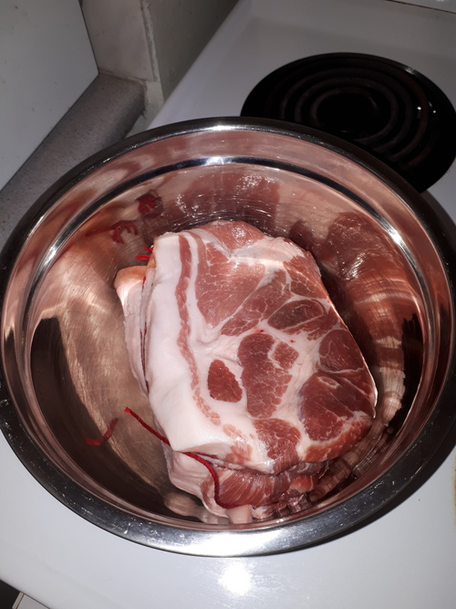

For the rub I decided to follow a recipe. This rub was great, and I've since used it on other meats! It has a nice red pepper and garlic taste, with a bit of heat from the cayenne. The original recipe asked for regular paprika, but I used smoked paprika instead, which must have contributed to some of the flavour. (Smoked paprika has a similar taste to some brands of BBQ potato chips.)

For the sauce I used a mustard BBQ sauce. I love mustard! This sauce was a bit strong due to the apple cider vinegar, but when added to the meat the flavour is subdued.

### Memphis-style rub

Adapted from: [https://www.thespruceeats.com/memphis-bbq-rub-335875](https://www.thespruceeats.com/memphis-bbq-rub-335875)

* 1/8 cup smoked paprika powder
* 1/8 cup cayenne pepper powder
* 1/8 cup garlic powder
* 1/8 cup chili powder
* 1 teaspoon salt
* 1 teaspoon ground black pepper
* 1 teaspoon onion powder
* 1 teaspoon celery salt

### Carolina-style BBQ sauce

Adapted from: [https://www.thespruceeats.com/big-daddy-carolina-style-barbecue-sauce-333684](https://www.thespruceeats.com/big-daddy-carolina-style-barbecue-sauce-333684)

* 1/2 cup apple cider vinegar
* 3/8 cup brown sugar
* 1/4 cup grainy dijon mustard
* 1/4 cup yellow prepared mustard
* 1/8 cup water
* 1 tablespoon of rub

## Preparation

I mixed the ingredients of the rub together and sprinkled 1/4 cup of it onto the meat in a bowl. By working the meat with my hands, I was able to spread it over the surface.

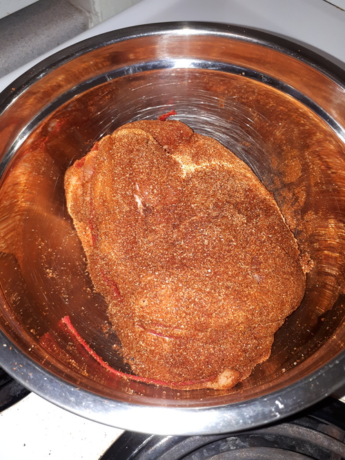

I had bought a new meat injector at the store, so I was excited to try it out! I mixed 2 teaspoons of my rub mixture into 1/4 cup of water in a bowl. I then started injecting the liquid mixture but quickly had it shot back at me! A pretty embarassing mess-up on my end. (The shirt stains weren't permanent thankfully.)

What went wrong with the injections? When I was doing it, it took a bit of pressure on the plunger to move the mixture into the meat, but the syringe itself didn't feel much of it. When I withdrew the needle, the pressure I added through the plunger was released.

It seems to be that you shouldn't try to put too much into the meat, and you may be fine letting the liquid drip in without plunger pressure. The lack of quantity can be made up with more numerous injections over the meat.

When I was done with the injections the meat and the rub were a bit soggy. I put the meat in a ziploc bag and in the fridge. When I brought it outside, I made sure to have an ice pack next to it.

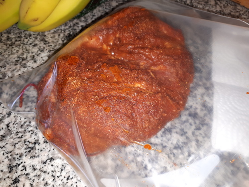

## Cooking

This was cooked on a 18" Weber "Jumbo Joe" charcoal grill. Since I was finishing my bag of briquette charcoal, I mixed in half hardwood charcoal. This I used to fill a large Weber charcoal chimney. It's possible that the quantity of charcoal was a bit too much, and I will report back how well a smaller amount works.

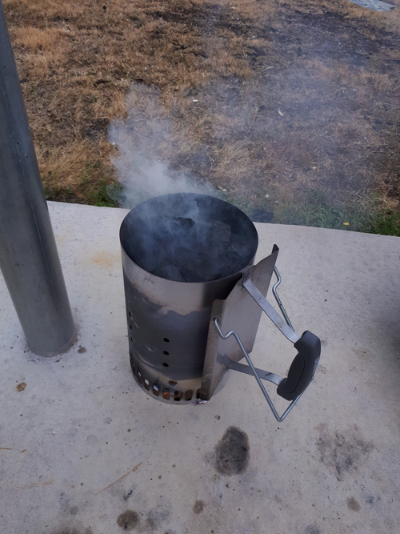

Now when it came to picking my smoking wood, I discovered that I hadn't labelled any of it last year! By looking at the chunks closely, I thought I was able to identify the hickory and the applewood. Applewood has a light grey bark while the hickory wood is lighter and brighter. I think I guessed correctly, but I couldn't say for sure. I suspect I may have picked pecan and mesquite instead. **Label your smoking woods!**

I used both woods in turn. First the hickory, then the applewood. (I burned some on the side while cooking to try to identify them by the smoke.)

The BBQ I set up by pushing the coals to one side and putting water cups under the grill on the other side. On top of the coals I put the wood chunks and over the water I put the meat. The water is there discourage drying the meat.

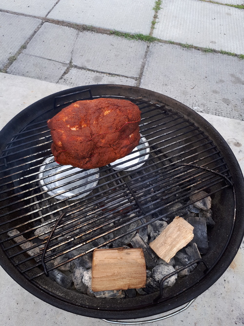

During the smoke I kept track of the temperatures with two thermometers. I used a shorter BBQ thermometer to measure the inside air temperature (300F to 350F is ideal). I also used a longer candy thermometer to pierce the meat and monitor its temperature (it should increase slowly over time up to 175F).

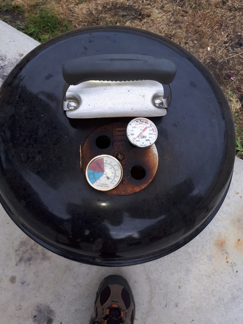

An hour later I opened the cover to add more smoking wood chunks and water to the cups. The meat had already started looking tastier. I want to point out here how much grease has already melted into the water, which still manages to boil visibly with bubbles escaping through the fat. I discovered later that this grease can catch fire if it drips into the coals, so be careful!

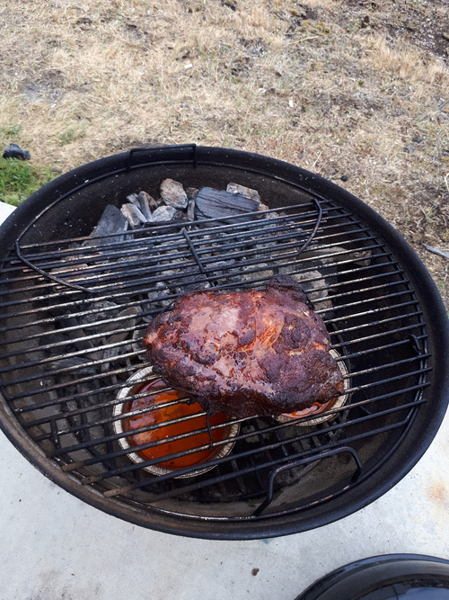

Since I think I put too much coal, I was worried that there was too much ash. I lifted the grill and put it aside, and then I quickly moved the coals to the other side of the grill. This eliminated the ash building up in the coals and hopefully made it easier for them to burn. Too much ash means not enough air and so not enough heat, a situation that can mean a stalled BBQ.

By the end of the smoke, the rub was looking a bit charred. This doesn't seem to have affected the flavour, but it's a bit worrisome.

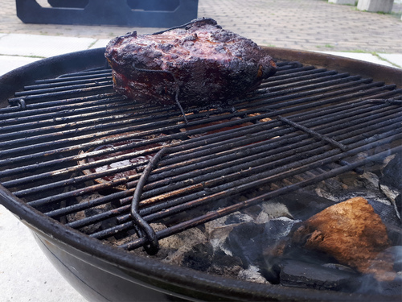

## Serving

I wrapped the meat in a foil container and left it in the oven at 300F. As you can see below, there were still some juices in there.

The BBQ sauce was straightforward. Simply mix the ingredients and simmer for 20 minutes, stirring frequently. The brown sugar will cook with the mustard a bit. It is a pungeant sauce, and you'll smell the vinegar and mustard.

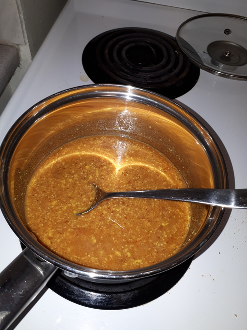

I found that the pork shoulder had lots of fat. This made it easy to separate into chunks, but I found that I had to spend some time to "fork" the chunks individually. The sauce was absorbed by the meat and the two became a chunky mixture that was easy to scoop onto bread.

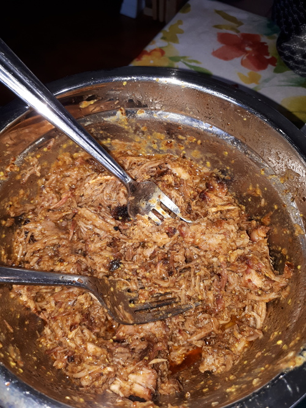

## Results

The rub and the sauce made a tasty combination. The strong tang from the mustard and vinegar were partially offset by the garlic and spice from the rub. The high fat content of the meat made it very smooth. Unfortunately, there was not a lot of smoke flavour.

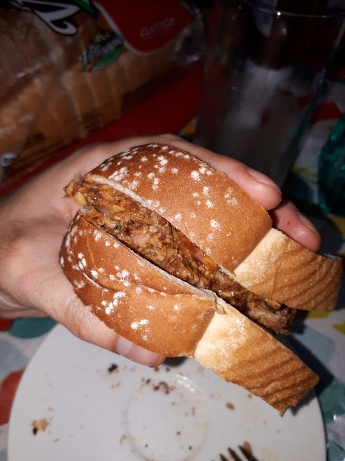

