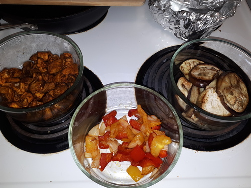
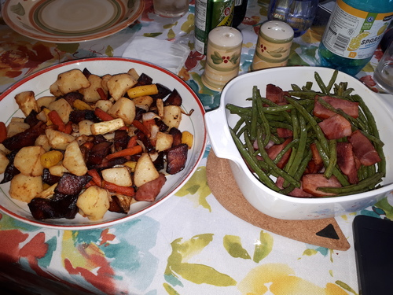

### Past week

#### Eggplant wraps

We had three Italian/Sicilian eggplants. I cubed two and put them in the air fryer, and the other one I sliced and pan fried. I also air fryer some bell peppers with onions. Everything going into the air fryer was coated in peanut oil, and the frying pan eggplants were fried in olive oil.

  * Air fry cubed eggplants 30 minutes at 350F; keep covered and warm in oven at 200F
  * Air fry peppers and onions 12 minutes at 400F; keep covered and warm in oven at 200F
  * Pan fry sliced eggplant at medium heat for a long time (not satisfied)

The cubed eggplants I tossed in peanut oil and premade chili seasoning (the kind of spice mix that comes with a chili recipe in the back). I cooked these cubes for 30 minutes at 350F in the air fryer. I frequently checked and tossed them to make sure they were alright.

By the end, the air-fried eggplant cubes had lost most of their moisture and were delicious!

The peppers and onions I air fried for 12 minutes at 400F. Since there wasn't a lot of these, they cooked quickly.

Both of these I left in the oven at 200F. I think this softened them further.

The pan-fried eggplants didn't turn out well. When I left them in the oven though, they softened up at least.

We put this all in wraps, along with leftover pork and cheese. We air-fried the wraps a few minutes since it's a nice way to crisp them up.

#### Random bits

I'm not sure how these would be called in English. They're cubed root vegetables (potatoes, carrots, parsnips) with string beans and ham.

  * Air fry mixed vegetables for 30 minutes at 400F, tossing often
  * Air fry beans and ham for 12 minutes at 400F, tossing twice

This was alright. The beans were still crunchy in the middle, probably because the air fryer basket wasn't crowded. When you crowd the basket it tends to steam things rather than fry them, which helps some food soften.

### Future

I'm going to try more eggplants! I hadn't known that they're very tasty when thoroughly cooked.

If I put less eggplant in the basket, will they cook and dry faster? It's worth a try.
