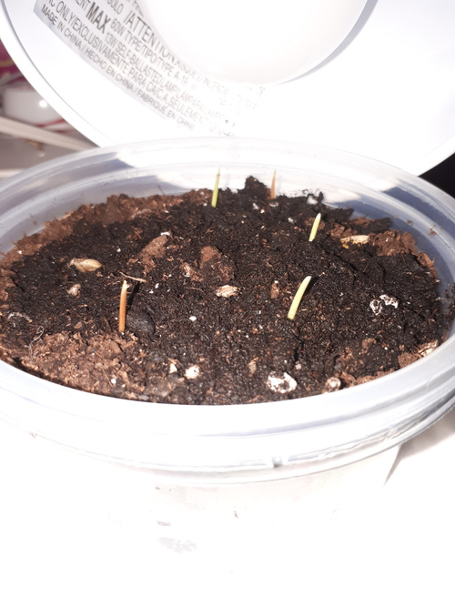
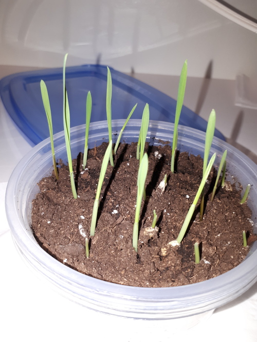
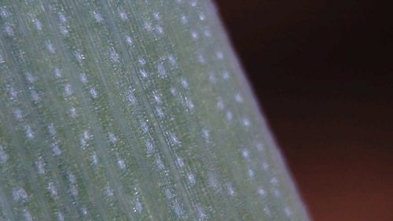
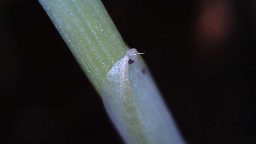
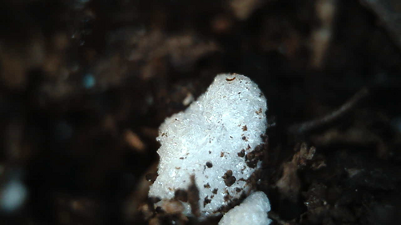

### Past work

I germinated the seeds and planted them. They were slow to get going but now they're growing like, well, weeds.

Yesterday they were tiny.

Today they've grown an inch or two.

For fun I plugged in my cheap USB microscope and had a look.

Here is a closeup of the grass blade.

The grass grows sheathed. It starts out as a white rounded stalk but opens to extend a wide green blade of grass.

My potting soil has what I think is perlite to help aerate it. Perlite is glass turned to a light foam-like state by heat. I think it may be a bit like popcorn? I used to use a lot of it when I was playing with hydroponics.

### This week

I'm going to let it grow. I've wondered a little whether I should get cheap grow lights from Amazon and see if they beat my current bulb or natural sunlight. Could be interesting.

