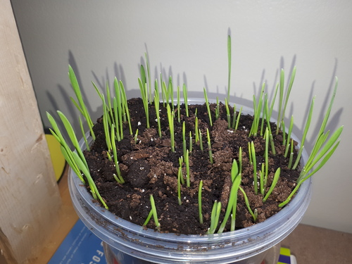
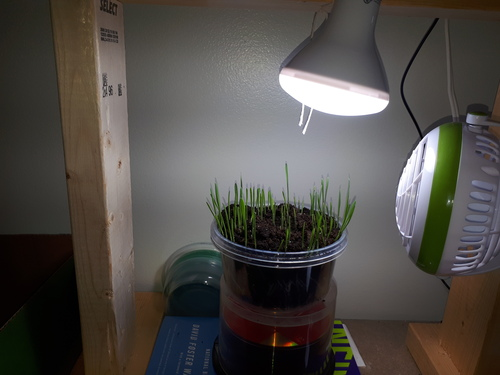
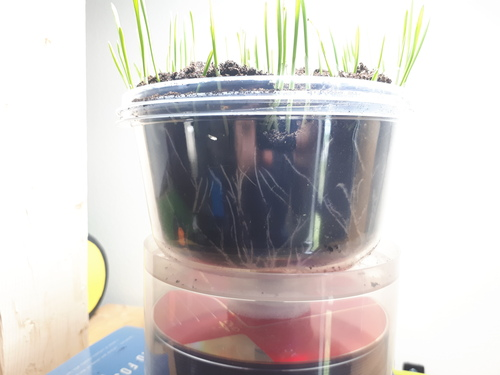

### Past week

I got some bigger containers from the dollar store to grow the plants in. I tried following the intructions on the seed packet by putting the seeds deeper into the soil. This caused some issues as we'll see below.

After only a few days the grass was able to break out from underground; though they had to do some heavy lifting in the process. As the plants have pushed upwards, the soil has overflowed the container.

My setup is pretty cheap. Just a lamp and a small fan suspended/attached by surplus 2x4 lumber. The contraption is on top of a bookshelf, so I get to climb a stepladder each time I want to see. (A minor source of recreation during the work day.)

(The light is on a timer: on from 6AM to 10PM.)

I think I should have only put 1cm of soil over the seeds. They seem to start too far below ground otherwise. I've found that the shoots are a bit sharp when I touch them, so I imagine they've learned to drill through earth to see the sun.

There is a bit of reflection in the photo, but you can see that a few plants have created an air pocket by pushing up against the soil

### Next week

My current setup is pretty lacklustre. How could I improve it?

#### Data collection

The setup would be more interesting if data were collected.

  * Timelapse photos of the growing process.
  * Time-series data of soil humidity.
  * Measuring growth somehow?

#### Hydroponics

It would be interesting to use hydroponics in an advantageous way. Rather than wasting soil, I could re-use a growing medium. Or if the growing medium is cheap and disposable, I can just throw it away.

I wonder if the seeds could be suspended in perforated paper towel or some other absorbent material. Would the roots dangle down or propagate horizontally? What about the grass blades having enough support to stay upright? Cheesecloth or burlap may work.

#### Grow lamps

There are some cheap grow lamps on Amazon. Comparing them against normal light and sunlight could be interesting.
