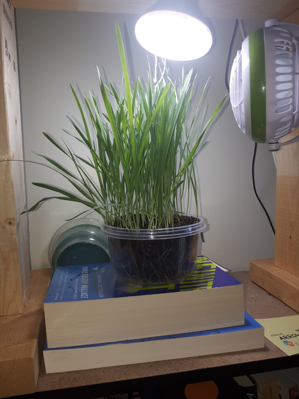
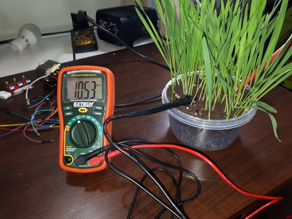
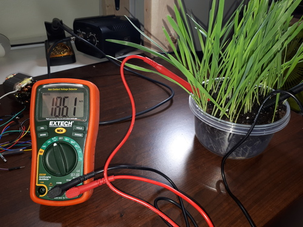

### Past week

The grass has been getting stronger! After removing the CD case, lowering the container 2-3 inches, the grass once again reaches the light!

During the week I realized that soil humidity meters work by measuring resistance. Damp soil conducts electricity better, while dry soil conducts poorly.

The soil moisture sensors work by feeding voltage to their prongs, and they return a variable voltage. My multimeter effectively does the same thing when it measure resistances, so it should work too.

I measure the resistance with the soil dry. I get 10M ohms, which is quite a lot. (To be fair, I expected infinite resistance.)

After I poured water into the container and got it nice and wet, the resistance was now 186k ohms, 1/60th the ohms of the dry soil. Again, I expected higher resistance with the probes being two inches apart. Electricity must conduct well in wet soil full of minerals and the like.

### Next week

I desoldered the header pins from my Raspberry Pi Zero, so I could use it as a camera. The case won't close with the headers facing up. Darn!

The soldering was tough. I tried removing all of the solder with a solder sucker and solder wick. I put the pi in a breadboard to dissipate a bit of heat. All the wicking and sucking wasn't enough to separate the headers: the GPIO has a lot of pins so it's quite the task...

I ended up securing the pi, and I pulled out the pins one-by-one by heating them on one side and pulling them out with pliers. When the solder melted, the pins slid right out. Messy but effective.

Below you can see how there's a bit of solder left over. There's gunk everywhere. Could it be cleaned with alcohol?

The Pi still works though.
