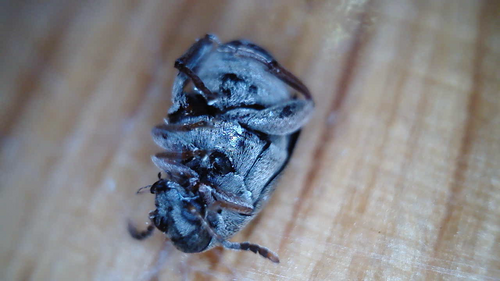
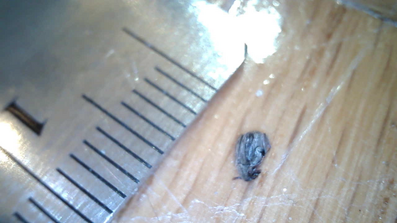
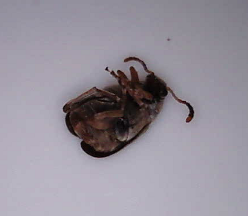
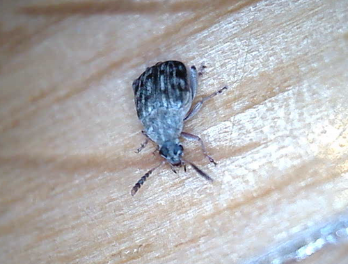

## Once upon a time

Last fall I was feeling like I didn't want to go to the store too much, so I decided to buy a lot of long-lasting food all at once. All the dried beans I kept in a cooler.

(At the time I didn't have an easy way to cook the beans, so the purchasing decision was weird.)

I bought myself an Instant Pot and was really looking to make my own beans. When I got to rinsing the pinto beans, a swarm of bugs floated up in the water. (So *that's* why you wash and sort beans.)

The beans were all infested!

We separated everything from the cooler into separate containers. A month later, it looks like the three bags of beans were the only thing infested.

## Probably weevils

Ever since I bought a USB "endoscope" from Amazon, I've been taking photos of random things. (The box box emphatically says that the endoscope is not for internal use!)

<https://en.wikipedia.org/wiki/Bean_weevil>

There were quite a lot of the bugs, but a lot of them were dead. They probably weren't doing too well in a cold apartment with only dried beans to eat.

I managed to put one next to a ruler and measure it to about 2mm.

Some of them seemed a bit dusty while others were more earthy-looking. I'm not sure if it was the lighting or that the dead ones were dried up.

There were some live ones though. I pulled one out and was able to get a good photo. They moved enough that it was hard to keep them in the frame.

Ferocious looking!

A bit of Googling makes me think that these really are weevils. The page below has a better photo than Wikipedia.

<https://bugguide.net/node/view/765912>

From now on I pay __much__ more attention to my beans!
