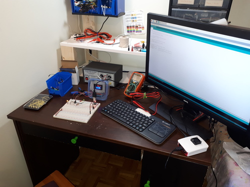

### Past week

I am really interested in building some kind of Arduino oscilloscope. This requires a nice workplace for the Arduino but also a computer nearby for programming it. I was able to fit a 24" monitor onto my little desk.

The desk is an [Ikea Brusali](https://www.ikea.com/ca/en/p/brusali-desk-brown-30302299/), so 90x52cm.

It's not that bad since most of the work is done on a breadboard. A good pair of tweezers can pick up things when space is tight. If I were soldering, I'd be banging my arms everywhere.

### Next week

I've ordered a few things to help me out.

An HDMI to VGA adapter will let me use a smaller VGA monitor with the Raspberry Pi, freeing up some space.

I'm also getting a bigger breadboard with binding post power connectors. The board can have two independant power supplies, which is important if I want the oscilloscope circuit to measure a separate circuit that oscillates. I need the Arduino's power supply to be clean.

I'm also getting variety packs of capacitors. I'm hoping to be able to convert the square wave of a 555 timer into a sine wave. And of course I'll only know this has worked if I have a homemade oscilloscope to measure it.
