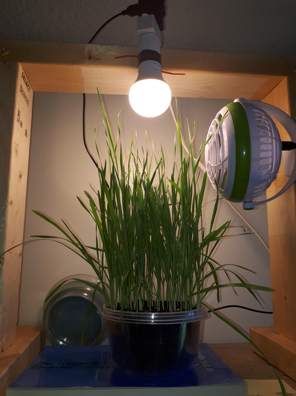

### Past week

I changed the light from a daylight spotlight to a warm-white bulb. I also reduced the light time from 18 hours to 12 hours.

I'm hoping that the change in light will make the plants flower. Plants often do this in response to shortening days. It's called "bolting". You've likely seen it happen if you've grown lettuce: the plant stops growing tasty leaves and instead makes a long bitter stem (and perhaps yellow flowers).

Some of the grass is getting a lot longer, so it may be working. One of my cats has started meowing at it (the plant is on top of a bookcase, out of reach).

### Next week

Some of the grass seems to be burning at the tips. This might be from a lack of nutrients. I've started adding a bit of fertilizer to the water.

It looks like the hardware store sells decent-looking LED grow lights, so I might pick up a bulb to tests its effectiveness. The grow bulbs on Amazon look terrible. There are enough critical reviews to make me suspicious.

(After reading this article, I've started doubting the "top" reviewers: <https://arstechnica.com/gadgets/2020/09/amazons-top-uk-reviewers-appear-to-profit-from-fake-5-star-posts/>)

If I were to get the bulb, I would put two pots next to each other separated by a partition. One pot would get a normal daylight spotlight, the other would get a grow light. Which will grow faster?

The store also sells perlite, vermiculite, and peat. If I can cobble together a hypdroponics system (probably nutrient film?), I could have some fun playing with that. I am not sure where to find tubing for my miniature pumps.
