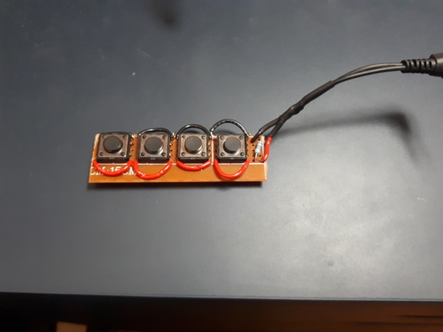
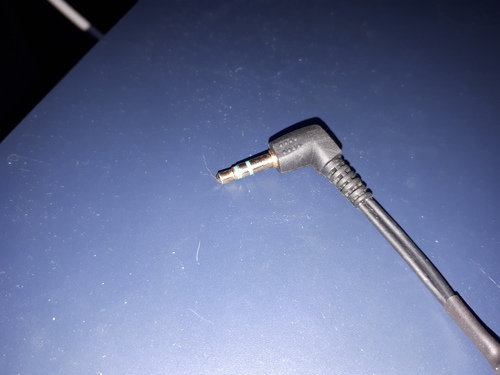
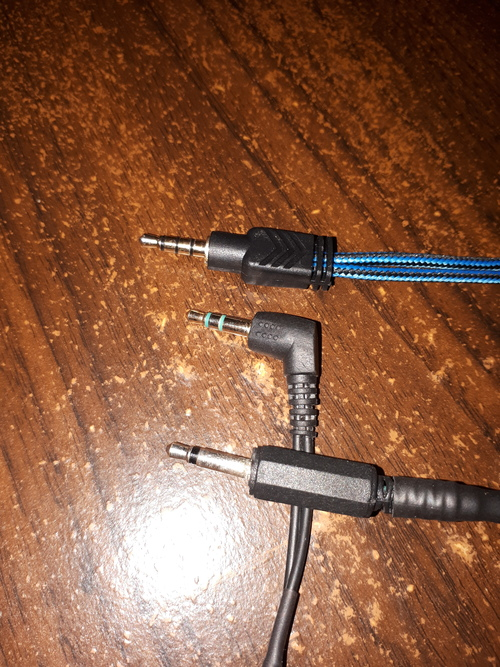
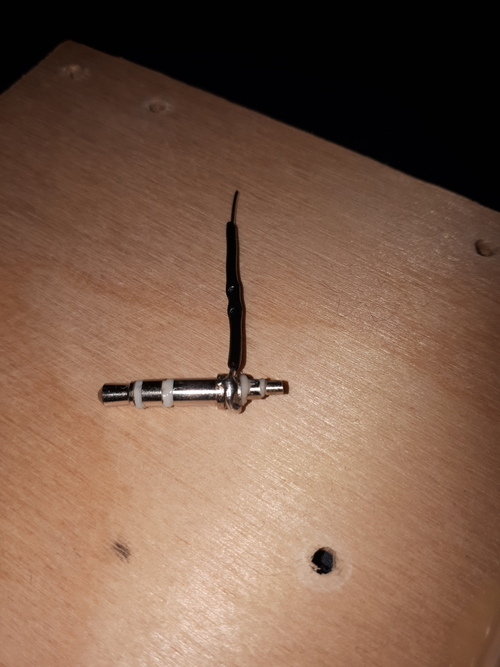
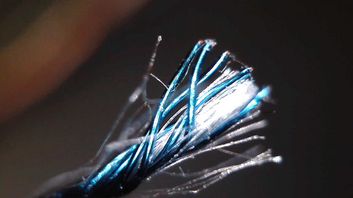
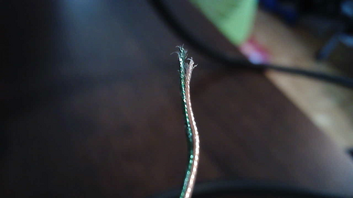
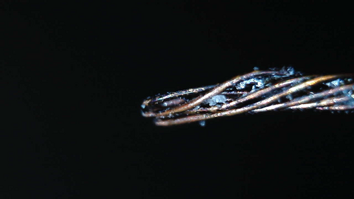
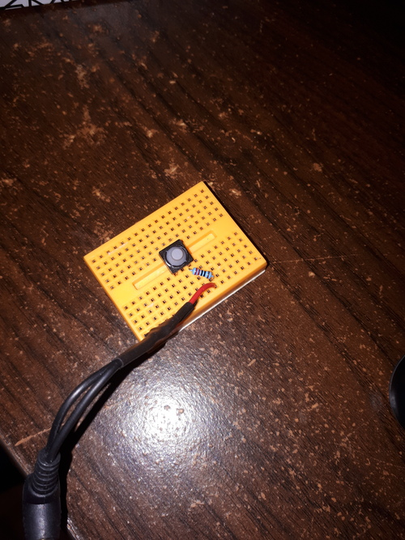
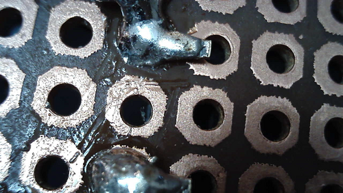
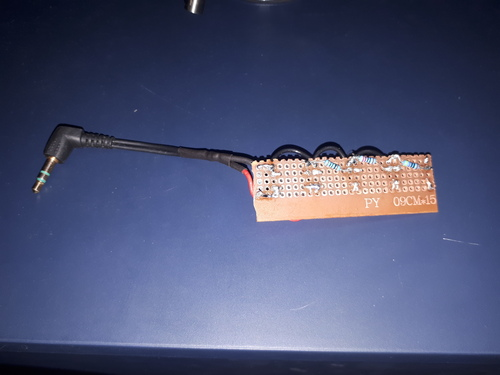

### Basic idea

You can tell your phone to play/pause/hang-up by sending signals through the microphone. It's as simple as shorting the microphone to ground. It is also possible to have buttons to increase/decrease volume. This function is integrated into headsets and headphones+mic combos.

Here's a demo of this. (I can't seem to record any audio, so all my videos are muted.)



The voltage level signals are defined by resistor values, all explained here: <https://source.android.com/devices/accessories/headset/plug-headset-spec>

If all you want is the play/pause, then all you need to do is find a way to short the microphone.

### What you need

I'm assuming most people will have a pair of headphones that they like and they just want to add a button to it.

I think the best idea then is to get a microphone/headphone splitter. You can plug in your headphones and then you just need to plug in your contraption into the microphone half of it.

The black connector goes into the phone, the green receptacle is for the headphones (out), and the pink receptacle is for the microphone (in).

You will also need one or more sacrificial headphone connectors. It's much easier to work with the wires still intact: soldering directly to the connector can be a challenge.

### Information on the 3.5mm jack

I think we all know this type of connector as the standard headphone jack. Walkmans, computers, and phones all use it.

Below I have three examples of it. The shape is generally the same, but the number of pins/connections varies. The separate connections are the bands separated by the black/green plastic. The ground is always the closest band to the rest of the plug, the part in rubber or solid plastic.

The top connector with 4 connections is from my Y splitter. It's also used for headphones with an integrated microphone. The connector can carry (from left to right) the L+R stereo signal, the microphone signal, and the ground; a total of 4 connections.

The middle connector is just a standard headphone jack. It has L+R stereo and the ground. This is the kind of 3.5mm jack you usually see.

The bottom connector is from a microphone/speaker you can clip somewhere. It only has two connections, so you would need to push a button to talk, like a walkie-talkie.

### Don't melt the 3.5mm jack!

The 3.5mm connector itself uses plastic to separate the connections. The ones I've taken apart had large blobs of lead solder to connect the wires. If you're not quick, you can easily melt the plastic and ruin the connector.

The connector below had its insides melted from me applying 450C+ heat for 10+ seconds. The microphone is now permanently shorted to ground.

### Pesky little headphone wires

Headphone wires are very fine in order to be nice and flexible. They come with a coating that will block electric current. With my multimeter on continuity mode, I can only get a connection at the tips of the cut wires; the lengths of the wires are all well-isolated.

This makes them annoying to work with. Unlike bigger wires, you can't just strip off the insulation and splice them wherever you want. You also have to be careful when soldering since you can destroy them by pressing a dry iron tip to them.

Below you can see an example of this tiny coated wire. Both the signal wire and the ground wire are together in the same housing, so they need the coating for the headphones to work properly.

You might be tempted to burn it all off with a lighter, but it makes a mess. There may end up being too much charred junk to make a good connection.

It turns out one trick is to dip the wire into molten solder. This burns off the coating while also replacing it with a tin/lead coating. I just set a big blob of tin solder at 450C and run the wire through it.

Here is me doing the bluish coated wire. (With audio you could hear the sizzle!)



Here's the clear/nylon wire (the ground) with the solder getting a bit dirty.



After this, you end up with some partially-tinned wires that are easier to work with.

### Testing out some resistor values

I assume you now have a 3.5mm connector with some nice sturdy hook-up wires. I used 22 AWG solid-core since it's great for breadboards.

Before you settle on your permanent board, it's a good idea to make sure you can get it all working on something non-permanent.

If you're interested in play/pause only, you just need to short the microphone. If you want to change the volume, 220 ohm and 470 ohm resistors should be a good start.

You can test these on a breadboard with a button. Keep pressing the button and see what happens to your phone. As you test different values, write down their effects.

### Soldering everything to protoboard

I learned two things:

  * Clean the copper pads first. If it's old stuff from the back of the drawer, it'll have oxidized.
  * Give yourself some room to place the components. Don't just cut the protoboard to *exactly* the size you need to fit the buttons.

The solder didn't really stick to the pads. I just kept applying more until the thing seemed like it would hold together. I might as well have used cardboard...

Everything went okay, but I ended up with a cramped board. I really like these buttons; I forgot about everything else.

I put a 5k ohm resistor across the MIC and GND since I figured the phone might expect it. (This is a value from the Android documentation.) The phone may need a small current to keep passing through the microphone or otherwise it won't be aware of its existence.

The circuit is nearly identical to the one from the documentation, except that my resistor values are slightly different and ordered differently: <https://source.android.com/devices/accessories/headset/plug-headset-spec>

### Lessons learned

The board works poorly. The play/pause button and the volume-down button work, but the volume-up button almost always fails.

I suspect that there's something not right with the buttons. It could also be that the phone expects cleaner signals that I'm generating.

I wonder... how does this specification work alongside a real microphone? When someone uses the button on a phone call, is there any noise added to the audio?
