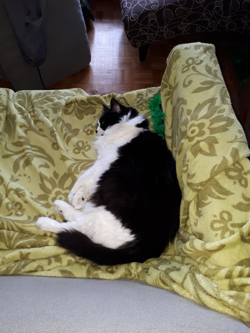
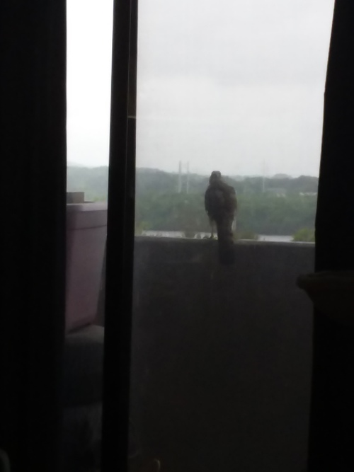

## Poor babbys

Here is my cat sleeping on the couch. It's the same place the other cat was sleeping last week.

### Drama!

The other cat was sleeping in the cat tree when a bird tried to eat it! The large bird hit the window glass and then went on the edge of the balcony.

It appears to have been a merlin. According to Wikipedia, merlins can be about a foot long, so this might have been a slightly bigger one. The tail matches the pictures.

