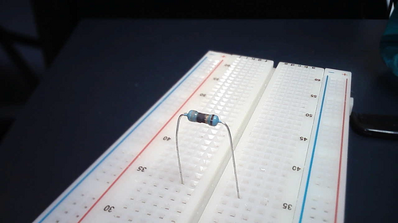
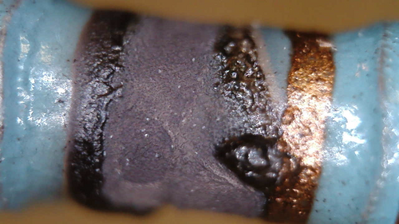
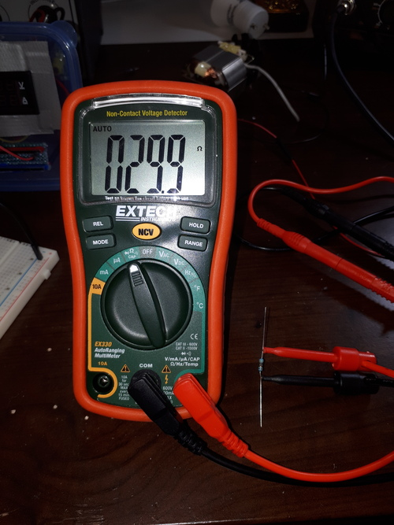

### Past week

I started playing with the $10 voltmeter/ammeter I got from Amazon. It seems neat at first, but its lack of precision makes it less useful (or rather, useless). I don't see the use of this for electronics.

I rigged up a tupperware container to house it. Out the back I have lug connectors for the power supply and at the front I have headers for jumper wires. There are back connectors for 5V (meter's supply), positive voltage, and ground.

Unfortunately, the meter is not very accurate for electronics. The voltage resolution is only 0.1V, and it seems to underestimate lower voltages.

The ammeter only activates at about 0.10A and underestimates these lower current values. I had to add a bunch of 1k ohm resistors in parallel to get a reading.

While I was trying to coax a current reading from the meter, I got to burn a resistor. Poor guy gave up his magic smoke.

On close-up, the paint is what seems to have burned. I'm actually curious what its resistance is. It was originally 47 ohms.

I got out my multimeter to have a look! From 47 ohms it dropped down to about 30 ohms. Poor fellow lost more than a third of his vitality.

### Next week

I may investigate making my own voltmeter from an atmega-328. Its analog pins convert a 0V-5V analog signal into 1024 levels. This can be output to a small LCD screen and do about the same thing as my Amazon voltmeter.

With a voltage divider, the range can be extended to 0-30V. It would be able to measure whatever my power supply gives.

More interesting for electronics would be to have it measure around 5V. Depending on how extreme I expect voltage drops to be, it could hang around 4-6V and give decent resolution (2mV).

Since I'm new to electronics, it's nice to have examples to work off from. This guide gives lots of useful information: <https://www.instructables.com/id/Oscilloscope-in-a-Matchbox-Arduino/>

Step 11 of the above guide has a simple voltmeter.

