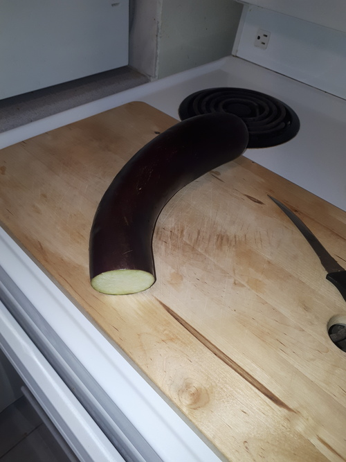
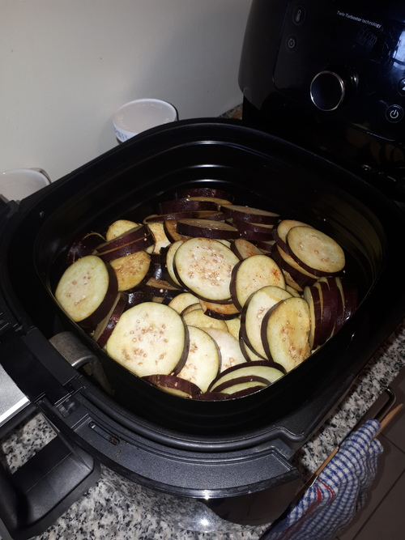
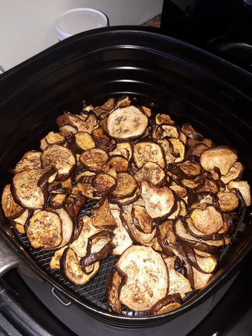
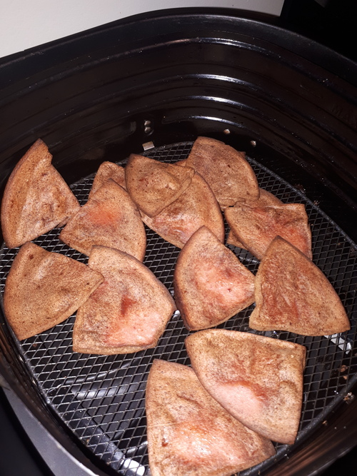

### Eggplant chips

These cooked well but weren't that great. The eggplant skin was chewy (but no doubt full of fiber). I think this would have been great with some of the skin peeled off.

I started with three Asian eggplants. I cut them all up in 5mm thick disks.

There was enough eggplant to fill the XXL air fryer.

I cooked the eggplant for 35 minutes at 350F, tossing every 10 minutes. Yeah, it took a while.

Despite the chewy skin, this was still a feel-good dish. It didn't taste particularly good, but I felt like I gave my jaw muscles a good workout.

### Fried bologna

I fried some pork-chicken bologna. It was "Blue Ribbon" quality according to the packaging. I may have eaten bologna royalty.

It took 30 minutes at 350F to fry it all. Unfortunately, it's not something that fries well in an air fryer. It's a catch-22. If you spread them out, you create a meat barrier that blocks the airflow. If you toss them around, the slices cover eat other and won't crisp.

Final impression: tastes like hotdogs.

