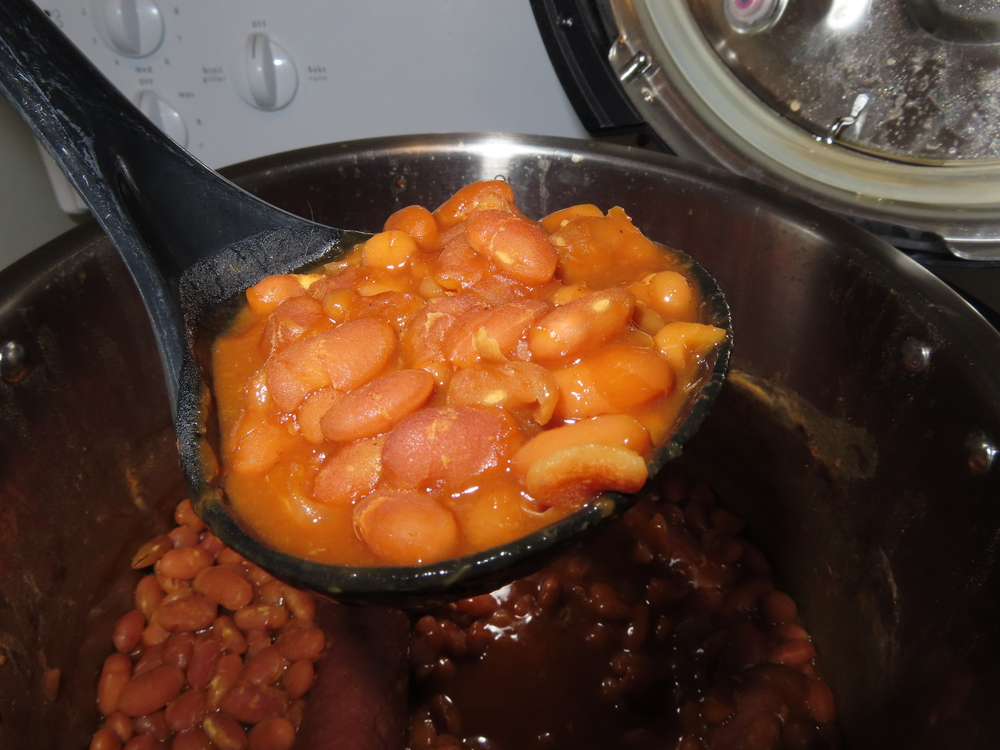

## Background

I bought an Instant Pot months ago, and I've been cooking a lot of beans in it. Most of the time I make chili-like beans and soups, but one day I decided to try BBQ sauce as the only seasoning.

The internet warns about cooking beans in any kind of acid. They'll be hard they say. The acidic BBQ sauce I use does make the beans more stubborn to cook.

This is my second time using this recipe. The beans are easy to make, well-cooked and tasty.

## Video



## Results

Very tender beans.

## Ingredients

These quantities are enough to nearly enough to fill a 6Qt Instant Pot to its half-fill mark, which is the maximum they recommend for beans.

  * 2 cups of white beans (I use great Northern beans)
  * 6 cups of water
  * 3/4 cups of BBQ sauce
  * 4 frozen sausages

At the store, look for a BBQ sauce with ingredients like: sugar, vinegar, molasses, and tomato paste. They may come in a different order. The sauce ends up not tasting like BBQ sauce at all after cooking. It really just tastes mildly like sweet tangy molasses. The tomato paste mostly contributes to the colour.

## Recipe

The acidity of the BBQ sauce makes the beans cook more slowly, so they have to be stirred and simmered half way. Normally beans only require 30-40 minutes of high pressure with natural release.

There's some debate over whether you should soak beans before cooking them in an Instant Pot. It depends on the beans and the recipe. Within the same bag of beans, some beans cook more slowly. A bit of soaking helps.

  * Soak beans in cool water for 15 minutes, discard water
  * Place 2 cups beans, 6 cups water, 3/4 cups BBQ sauce, and sausages in the Instant Pot
  * Stir
  * Pressure cook on high for 40 minutes, with natural release (30 minutes)
    * Note: it may take 20 minutes or more for the pressure to build
  * Open, stir, and simmer on low for 20 minutes
  * Again pressure cook for 15 minutes, this time quick releasing to save time (5 minutes)
  * Simmer on low again for 10 minutes

After the second simmer the sauce will have thickened and the beans will be very tender. The sausages will be fork-tender and will be falling apart.

## Further thoughts

I think the act of opening the lid, stirring the beans, and simmering them a little is what helps the beans soften. I think they just need to be moved around a little.

Pressure cooking doesn't seem to jostle the beans at all. While they pressure cook and they natural release, the high pressure prevents any boiling. The air is saturated with steam so the hot water can't create any more (ie: boil).

It may work to do

  * 20-30 minutes for the ingredients to heat up and the pressure to build
  * 10 minutes high pressure cook, natural release (30 minutes)
  * 10 minutes stir and simmer on low
  * 10 minutes high pressure cook, natural release (30 minutes)
  * 10 minutes stir and simmer on low

I'll try it next time with this recipe. Other bean recipes work fine with a single pressure cook.
