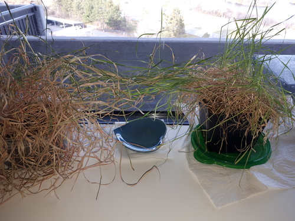
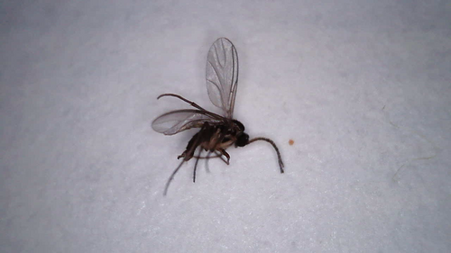
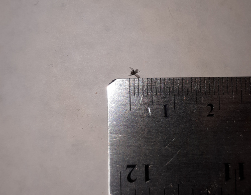
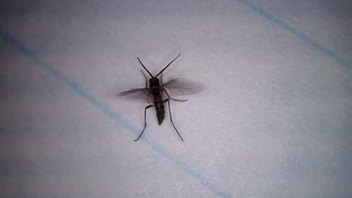
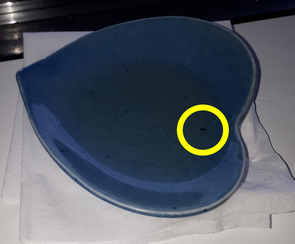

## Mystery bugs

For a few weeks we've been seeing small flies in the apartment. At first I thought they were dormant fruits flies reinvigorated by the warmer weather, but I noticed that they didn't quite look like fruit flies. They didn't have the large red eyes. The new bugs were also a lot easier to kill. You could slap them out of the air without them noticing. Finally, we didn't have fresh fruits lying around.

The only live plants around were the cat grass.

### Identification

Here are the articles for fruit flies and gnats, so that you can see some photos of what they look like.

  * The common fruit fly <https://en.wikipedia.org/wiki/Drosophila_melanogaster>
  * The fungus gnat <https://en.wikipedia.org/wiki/Fungus_gnat> (the image below looks *a lot* like this one)

Thanks to my USB microscope, I was able to get a few useful photos.

My first catch was one that I crushed. I kept it and brought it to my desk for photos. Since it was curled up, it was difficult to get its profile.

I put it up next to a ruler to show how small it is. It is 1-2mm long.

Finally I was able to catch a live one. This gnat I had only stunned, so it came back to life and stood up so that I could get a good look. It really does look like a fungus gnat.

Given these photos and the presence of the potted plants, I'm fairly confident these are gnats.

Interestingly, they don't seem interested in my soil-free cat grass, which is still under grow lights. It may be that the strong lights made the soil dry quicker, which discouraged the gnats.

### Mitigation

The internet says that a shallow container of 50/50 water and apple cider vinegar, plus a drop of dish soap, makes a good gnat trap. The gnats are attracted to the trap and drown in it. We also found that throwing away the plants solved the problem much more quickly.

The trap only had the chance to catch one gnat.

### Hypothesis

During the summer, I turned my microscope towards the cat grass's roots. I was able to find some larva crawling on it. Could these have been the gnat larvae? I'm not especially convinced. They don't seem visually similar to what I find from a "gnat larva" image search.

